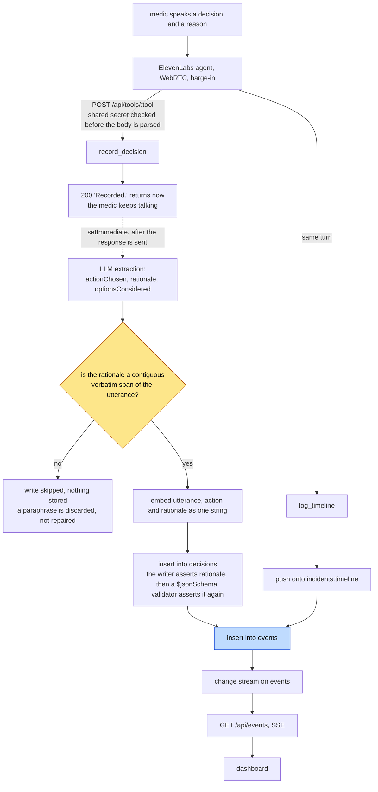
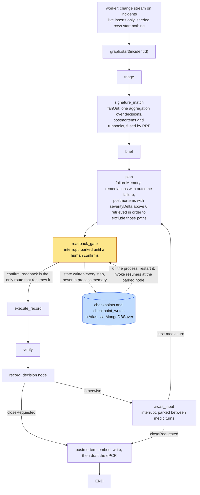

# BlackBox

**A voice-native flight recorder for EMS crews.** During an active call it listens to the medic over an earpiece, captures the decisions they make and the reasons they give, writes that reasoning to MongoDB Atlas as it happens, drafts the patient care report at transfer of care, and retrieves what it learned on the next similar call to brief the next crew.

> **One in seven New York EMS calls (15.0% since 2023) turns out to be something other than what it was dispatched as.** That reasoning currently dies in radio chatter and scrollback. BlackBox stores it - and hands it to the next crew before they need it.

Built in one day for the **Persistent Context Sprint Hackathon**, MongoDB `.Local` Build Fest, Pier 48, San Francisco - August 13, 2026. Required stack: **MongoDB Atlas, LangGraph, ElevenLabs.**

---

## Table of Contents

1. [Problem Statement](#1-problem-statement)
2. [The Solution](#2-the-solution)
3. [How It Works](#3-how-it-works)
4. [Architecture](#4-architecture)
5. [Tech Stack](#5-tech-stack)
6. [Project Structure](#6-project-structure)
7. [Getting Started](#7-getting-started)
8. [Running the Demo](#8-running-the-demo)
9. [Scripts Reference](#9-scripts-reference)
10. [Data Sources](#10-data-sources)
11. [Design Guardrails](#11-design-guardrails)
12. [Known Limitations](#12-known-limitations)
13. [Documentation Index](#13-documentation-index)

---

## 1. Problem Statement

Aviation solved this problem decades ago with the black box: every decision a flight crew makes, and the reasoning behind it, is captured and available for the next investigation. **EMS never got one.**

An EMT on scene narrates constantly - what they're seeing, what they're doing, why they're doing it - but none of that reasoning survives the call. It dies in radio chatter. The patient care report that gets filed afterward captures *what happened*, not *what was decided and why*. The next crew that responds to a similar pattern starts from zero, with no way to know what a prior crew tried, what failed, or what a subtle presentation actually turned into.

The scale of this is not anecdotal. Verified live against the NYC EMS Incident Dispatch dataset (`76xm-jjuj`, 29,978,154 incidents, queried 2026-08-13):

| Metric | Value | Basis |
|---|---|---|
| Calls where the final call type differed from dispatch (2023+) | **845,887 of 5,653,498 = 15.0%** | `initial_call_type != final_call_type` |
| Same, all time | 2,750,007 of 29,978,154 = 9.2% | |
| Calls **undertriaged** - severity upgraded after arrival (2023+) | **400,548 = 7.1%** | `final_severity_level_code < initial_severity_level_code` |
| Incidents that had to be reopened | 237,210 = 0.79% | `reopen_indicator = 'Y'` |

Every one of those 845,887 calls is a labeled case where the first read was wrong - and the reasoning behind the correction was never recorded anywhere. Existing incident-response tooling stores *actions* (ePCR fields, dispatch logs, postmortems). Nobody stores what the human *decided and why*, which is precisely the signal that would help the next crew catch the same pattern faster.

Voice is the only capture medium that can get this, because during an active call nobody is typing and an EMT's hands are never free.

## 2. The Solution

BlackBox is a single Next.js application built around three ideas, none of which are negotiable for a demo beat:

1. **Capture decisions with rationale, not just actions.** *"Skipping the supraglottic, family reports recent neck surgery"* is a decision *plus a reason*. The rationale is what gets embedded and retrieved on the next similar call. A decision document without a `rationale` is treated as a bug - rejected both by the writer in code and by a MongoDB JSON Schema validator.
2. **Store failures, not only successes.** A remediation or route that cost time is more valuable in memory than one that worked. `remediations.outcome` supports failure explicitly, and retrieval actively surfaces failed prior attempts so the same mistake isn't repeated.
3. **Close the loop end to end.** Call happens → voice captures decisions → agent drafts the report at transfer of care → report is embedded → next call retrieves it. That full circle, inside one demo, is the entire thesis.

The system never diagnoses and never proposes treatment - see [Design Guardrails](#11-design-guardrails). It only records what the medic said and recalls what a prior crew did.

## 3. How It Works

From the medic's side, there is no screen during the part that matters - earpiece plus a phone in a chest pocket. The system calls them, not the other way around.

- **Phase 1 - En route (~60s in the rig).** A MongoDB change stream fires on a new CAD record and rings the medic. The brief is under fifteen seconds and is entirely retrieval: what this call type usually turns into, what went wrong on similar runs, which receiving facility was on diversion last time. The medic can barge in and ask anything.
- **Phase 2 - On scene.** Two jobs run at once. The medic narrates what they're doing, which becomes the timeline. When they ask for something back, the agent retrieves the relevant NASEMSO guideline passage and reads it aloud. Every drug and dose is read back verbatim before it's written - aviation-style confirmation, and the human-in-the-loop gate in the underlying LangGraph state machine.
- **Phase 3 - Transfer of care.** The patient care report drafts itself from the recording. The narrative is embedded and becomes exactly what the next crew retrieves on their own call.

### The two-call demo

The scripted demo scenario proves retrieval does real semantic work rather than a string lookup:

| Call | Dispatched as | Turns into | Real NYC volume (2023+) |
|---|---|---|---|
| 1 | `UNC` - "unconscious or unresponsive" | `ARREST` - cardiac arrest | 14,987 incidents |
| 2 | `SICK` - "general illness" | `CARD` - occult cardiac event | 15,966 incidents |

Different dispatch codes, different presenting symptoms, same latent pattern. If the two calls were identical, vector search would look like a cache lookup; because they're variants, the signature match on call 2 has to do genuine semantic work to recognize the pattern from call 1's memory.

### The stage moment: kill-and-resume

Mid-demo, with the agent parked on a drug-dose confirmation, the presenter kills the Next.js process in front of the audience and restarts it. The agent resumes the exact same call from the exact point it left off. This works because the LangGraph agent's state is checkpointed to Atlas via `MongoDBSaver` on every step - never an in-memory checkpointer. The automated drill lives at `scripts/kill-resume-drill.ts` (`npm run drill`).

## 4. Architecture

### MongoDB is the entire platform - memory, state, and transport

The hackathon's own constraint (no third-party vector store, cache, queue, or broker) turns into the core architectural bet: **MongoDB Atlas is the only datastore, and it is also the event bus.**

- Any process - a route handler, the background worker, a `tsx` script - inserts into the `events` collection.
- The dashboard's SSE route opens a **change stream** on `events` and pushes each insert to the browser.
- Reconnecting after a page reload is a plain `find()` - no in-memory ring buffer to lose.
- The worker and the Next.js app coordinate with zero IPC, because they're both just watching the same collection.

When a judge asks whether the dashboard is real, the honest answer is: every number on it arrived through an Atlas change stream.

### Collections

| Collection | Contents | Index |
|---|---|---|
| `incidents` | Live document per call: status, CAD fields, an append-only `timeline` | standard |
| `decisions` | **The black box.** Medic utterance, options considered, action chosen, spoken rationale, timestamp, outcome | vector |
| `remediations` | Action taken, incident id, outcome, duration, side effects - failed ones are the valuable ones | vector |
| `runbooks` | NASEMSO clinical guidelines, chunked by protocol section | vector |
| `postmortems` | Auto-generated narrative at call close, embedded on write | vector |
| `events` | The event bus - change-streamed to the dashboard, 24h TTL | standard, TTL |
| `checkpoints` / `checkpoint_writes` | LangGraph `MongoDBSaver` state | managed by the saver |

`decisions` stays **empty** until the live demo - it is never seeded, because watching it fill up live on stage is the point.

### Retrieval: three collections, one Atlas pipeline

Retrieval fans out across `decisions`, `postmortems`, and `runbooks` in a **single Atlas aggregation** using `$vectorSearch` + `$unionWith`, then reranks the union with reciprocal rank fusion (RRF) rather than comparing raw cosine scores across differently-distributed corpora. `failureMemory` runs the same pattern over `remediations` + `postmortems`, filtered to known-bad outcomes. See `src/lib/retrieval/`.

### The LangGraph state machine

```
Trigger (change stream on incidents)
  → Triage
  → Signature Match      (vector search: have we seen this pattern before?)
  → Brief                (voice out)
  → Plan                 (retrieves failure memory to EXCLUDE known-bad paths)
  → Readback Gate        (interrupt() - human confirms verbatim)
  → Execute / Record
  → Verify
  → Record Decision
  → [on call close] Postmortem Generator → embed → write
```

`Signature Match` and the failure-exclusion logic in `Plan` are what make this a memory project instead of a runbook lookup. The graph parks at `interrupt()` between medic turns and resumes from the checkpoint on every subsequent invocation - including after a process kill. See `src/lib/graph/`.

### Ports, fakes, and parallel build

Every cross-cutting capability (embeddings, retrieval, memory writes, the LLM, the event bus, the graph, voice) is defined as a TypeScript **port interface** in `src/lib/ports.ts`, resolved at runtime by `src/lib/registry.ts` based on a `*_MODE` environment variable, with a deterministic **fake** implementation for every port under `src/lib/fakes/`. This is what let four workstreams (`ws/data`, `ws/graph`, `ws/runtime`, `ws/demo`) build fourteen phases in parallel against a shared contract, each one testable in isolation with every other port faked. See [`.ralph/contracts.md`](.ralph/contracts.md) and [`.ralph/overview.md`](.ralph/overview.md) for the full contract this repo was built against.

## 5. Tech Stack

| Layer | Choice | Why |
|---|---|---|
| Framework | Next.js 16.3 (App Router), React 19.2, TypeScript strict | Single app, single deploy, single language |
| Database | MongoDB Atlas 7.5 driver | Vector search, change streams, the event bus, LangGraph checkpoints - one platform |
| Agent orchestration | `@langchain/langgraph` 1.4.9 + `@langchain/langgraph-checkpoint-mongodb` 1.4.0 | `interrupt()` + an Atlas-backed checkpointer is the entire kill-and-resume story |
| Voice | `@elevenlabs/react` (browser WebRTC) + `@elevenlabs/elevenlabs-js` (server) | Real barge-in, real latency, first-class React hook |
| Embeddings | Voyage AI `voyage-3-large` (1024-dim), OpenAI fallback | Voyage is MongoDB-owned |
| LLM | OpenAI `gpt-4.1-mini` | Postmortem/report drafting and node-level prose only - never clinical decisions |
| Transport | Server-Sent Events over a MongoDB change stream | App Router can't upgrade to WebSocket without a custom server; SSE + change stream turns that constraint into the "MongoDB is the transport too" story |
| Styling | Tailwind CSS | No component library - the dashboard is a handful of cards |
| Runbook ingestion | `unpdf` | PDF text extraction in Node |

## 6. Project Structure

```
app/
  api/
    tools/[tool]/      # ElevenLabs server tools: recall_memory, get_protocol, log_timeline,
                        #   propose_readback, confirm_readback, record_decision, close_call
    demo/               # fire / close / reset - drives the scripted demo
    events/             # SSE route, backed by a change stream on `events`
    state/[incidentId]/ # LangGraph state snapshot for the dashboard
    voice/              # ElevenLabs signed-url / conversation-token issuance
    counters/           # per-collection write counts for the dashboard
    corpus/             # read-only corpus browser for the judge dashboard
  voice/                # the operator's voice console (what the "medic" actually uses)
  page.tsx, layout.tsx  # the judge-facing dashboard

src/
  lib/
    contracts/          # shared types, collection/index names, event union, API schemas
    ports.ts            # every port interface (Embeddings, Retrieval, Memory, LLM, Events, Graph, Voice)
    registry.ts          # resolves real vs. fake per *_MODE env var
    fakes/               # deterministic fake for every port
    db/                  # Mongo client, collection/index/validator setup
    embeddings/          # Voyage + OpenAI providers, batching, retry, Mongo-backed cache
    retrieval/           # the three-collection fan-out pipeline, RRF fusion, signature match
    graph/                # the LangGraph StateGraph, MongoDBSaver checkpointer, all graph nodes
    memory/               # decision writer, postmortem generator, ePCR draft renderer
    ingest/               # NYC Socrata ingestion, NASEMSO runbook chunking
    events/                # EventsPort real implementation
    voice/                 # ElevenLabs agent/tool wiring
  components/            # the dashboard: header, voice timeline, vector-search card, write counters,
                          #   graph footer, corpus/incidents tabs

worker/                  # long-lived process: change stream (or poll) on `incidents` → fires the graph

scripts/                 # every operational script - see Section 9

fixtures/                 # deterministic offline data: incidents, hits, postmortems, runbook chunks,
                          #   utterances, and a full recorded event stream for fixture-mode rehearsal

docs/                     # preflight.md - see Section 13

.ralph/                   # the full build spec this repo was built against: overview, contracts,
                          #   per-phase specs, and the append-only progress/agents logs
```

## Two paths into Atlas

Two things write to Atlas during a live call, and they are not the same path. A voice tool call writes on the medic's turn and must return before the next sentence. The LangGraph run writes on its own schedule and spends most of the call parked. They meet at exactly one route: `confirm_readback`.



The verbatim-span check is the load-bearing branch. The extraction prompt forbids inventing a reason, and a model told not to invent will still paraphrase one into existence; once a paraphrase is in the database it is indistinguishable from an invention. So the writer compares the returned `rationale` against the utterance and drops the whole write when it is not literally in there, rather than repairing it. `decisions` staying empty is a correct outcome, not a bug.

Nothing on this path is allowed to fail the voice turn. `emit()` never rejects, the background write logs `DECISION WRITE FAILED` and returns, and the SSE route drops frames for a slow tab instead of back-pressuring the change stream cursor into the process doing the insert. The SSE route also opens the change stream *before* it runs the replay `find()`; the other order leaves a window in which an event fired a half-second before the dashboard loaded is lost forever.

### Where the graph parks



The head of the graph runs once; the cycle is `plan` through `await_input` and back, once per medic turn. Both `interrupt()` nodes are where the process spends nearly all of the call, which is what makes the checkpointer choice observable rather than theoretical: with an in-memory saver both parks would still look correct inside one process and the kill-and-resume would fail with no warning.

Two consequences of that cycle are worth knowing before running a demo twice. An interrupted node re-executes from the top on resume, which is why `wrapNode` emits its events only after the node body resolves. And the concat-reducer channels accumulate across repeated `start()` calls on the same `incidentId`, which is why `POST /api/demo/reset` deletes checkpoints between takes.

## 7. Getting Started

### Prerequisites

- Node.js (matching `tsx` 4.23 / Next.js 16 requirements)
- A **Flex or dedicated** MongoDB Atlas cluster. **M0 free clusters cap at 3 Atlas Search indexes; this project needs 4** (`vs_decisions`, `vs_remediations`, `vs_runbooks`, `vs_postmortems`). This is a real, load-bearing constraint - see [Known Limitations](#12-known-limitations).
- API keys: Voyage AI (or OpenAI as fallback) for embeddings, OpenAI for the LLM, ElevenLabs for voice.

### Installation

```bash
git clone https://github.com/lgoyal6/BlackBox.git
cd BlackBox
npm install
cp .env.example .env.local
```

Fill in `.env.local`:

```env
MONGODB_URI=mongodb+srv://...        # Flex or dedicated tier, NOT M0
MONGODB_DB=blackbox
EMBEDDING_PROVIDER=voyage
VOYAGE_API_KEY=
EMBEDDING_MODEL=voyage-3-large
EMBEDDING_DIM=1024                   # MUST match the vector index numDimensions
OPENAI_API_KEY=
ELEVENLABS_API_KEY=
ELEVENLABS_AGENT_ID=                 # written back by scripts/setup-agent.ts
NEXT_PUBLIC_ELEVENLABS_AGENT_ID=
PUBLIC_BASE_URL=                     # tunnel URL; ElevenLabs server tools must reach this
TOOL_SHARED_SECRET=
```

`NEXT_PUBLIC_*` are the only variables exposed to the browser - no API key ever gets that prefix. Full variable list, including the seven `*_MODE` port switches, in `.env.example`.

### Database setup

```bash
npm run check      # Atlas preflight: connectivity, replica set, write access
npm run indexes     # creates 8 collections, the decisions rationale validator, and the four vs_* indexes
```

The first run of `npm run indexes` takes roughly two minutes while Atlas builds the vector indexes. Querying against an index that isn't yet `READY` returns an empty array with no error - always confirm status before assuming retrieval is broken.

### Data ingestion and seeding

```bash
npm run ingest:incidents   # ~180 real NYC EMS incidents from Socrata (no auth), finals quarantined under _groundTruth
npm run ingest:runbooks    # NASEMSO clinical guidelines, chunked and embedded
npm run seed                # 40 templated postmortems + 3 curated narratives (decisions stays empty)
npm run pitch                # caches the 15.0% headline number and reclass priors from Socrata COUNT aggregates
```

### Voice agent setup

```bash
npm run agent:setup   # creates the ElevenLabs agent + tool wiring, writes ELEVENLABS_AGENT_ID back to .env.local
```

### Run it

```bash
npm run dev       # Next.js app - dashboard at /, voice console at /voice
npm run worker    # separate process: watches `incidents` and fires the graph
```

## 8. Running the Demo

| Step | Command | What it does |
|---|---|---|
| 1 | `npm run check` | Atlas preflight |
| 2 | `npm run indexes` | Collections, validators, vector indexes |
| 3 | `npm run ingest:incidents` → `ingest:runbooks` → `seed` | Demo corpus |
| 4 | `npm run pitch` | Cache the 15.0% headline figure (never a live call during the pitch) |
| 5 | `npm run agent:setup` | ElevenLabs agent + tools |
| 6 | `npm run dev` + `npm run worker` + `npm run demo:fire` | Fire a live call |
| 7 | `npm run preflight` then `npm run smoke` | Fail closed if anything is still resolving to a fake port |

`npm run preflight` runs eleven checks (vector index readiness, `decisions` genuinely empty, the tunnel's shared-secret auth, the pitch-number cache, no port silently on `fake`, and more) and exits non-zero on anything that would sink the pitch. Full detail in [`docs/preflight.md`](docs/preflight.md).

**A NO-GO means running in fixture mode** (`/?mode=fixture`) rather than improvising a live run - a recorded three minutes beats a broken live one.

## 9. Scripts Reference

| Script | Command | Purpose |
|---|---|---|
| `scripts/check-atlas.ts` | `npm run check` | Atlas connectivity, replica set, indexes, write access |
| `scripts/create-indexes.ts` | `npm run indexes` | Collections, the `decisions` validator, all vector indexes |
| `scripts/ingest-incidents.ts` | `npm run ingest:incidents` | Pull NYC EMS incidents from Socrata |
| `scripts/ingest-runbooks.ts` | `npm run ingest:runbooks` | Chunk + embed the NASEMSO PDF |
| `scripts/seed-memory.ts` | `npm run seed` | Templated/LLM postmortem + curated narrative seeding |
| `scripts/compute-pitch-number.ts` | `npm run pitch` | Cache the 15.0% figure and reclass priors from Socrata aggregates |
| `scripts/verify-retrieval.ts` | `npm run verify:retrieval` | Index-readiness check, then four fixed relevance probes across the fan-out pipeline |
| `scripts/run-graph-local.ts` | `npm run graph:local` | Drive the LangGraph agent from the CLI, no voice needed |
| `scripts/kill-resume-drill.ts` | `npm run drill` | Automates the kill-and-resume stage moment end to end |
| `scripts/setup-agent.ts` | `npm run agent:setup` | Provision the ElevenLabs agent and its tools |
| `scripts/demo-fire.ts` | `npm run demo:fire` | Fire a scripted demo incident |
| `scripts/demo-preflight.ts` | `npm run preflight` | The eleven go/no-go checks |
| `scripts/demo-reset.ts` | `npx tsx scripts/demo-reset.ts` | Reset live demo state without touching seeded/curated corpus |
| `scripts/integrate.ts` / `scripts/smoke.ts` | `npm run integrate` / `npm run smoke` | Flip every port to real, run one end-to-end smoke path |

## 10. Data Sources

- **NYC EMS Incident Dispatch Data** (`76xm-jjuj`, Socrata, no auth) - the primary corpus. `initial_call_type` vs. `final_call_type` is millions of rows of real, labeled triage correction; severity codes give under/over-triage as a numeric delta; `reopen_indicator` is pre-labeled failure memory. Only small `$limit` slices and `count(1)`/`$group` aggregates are ever used - **the bulk CSV is never downloaded.**
- **NASEMSO National Model EMS Clinical Guidelines v3 (2022)** - the runbook corpus, already chunked by protocol section (indications, contraindications, steps), ideal for both vector retrieval and being read aloud by voice.
- **Cut:** NEISS free-text narratives (NASEMSO alone is enough corpus), NEMSIS (requires a TAC request form - a same-day non-starter, though it's the cited production path), the SF DataSF dataset (unit-response level, lacks the initial-vs-final pairing the memory thesis depends on), and Synthea.

## 11. Design Guardrails

These are load-bearing, not style preferences - weakening any of them for a smoother demo beat is explicitly the wrong call:

1. **The agent never proposes a treatment, dose, or diagnosis.** It only reads back what the medic said, or quotes a retrieved NASEMSO passage with attribution. The human owns every clinical judgment.
2. **`MongoDBSaver` only, everywhere - never an in-memory LangGraph checkpointer.** An in-memory saver makes `interrupt()` look like it works inside one process and fails the kill-and-resume with no warning.
3. **Every decision document carries a non-empty `rationale`,** enforced both by the writer in code (before any database call) and by a server-side JSON Schema validator.
4. **`decisions` is never seeded.** It fills live, on stage, or not at all.
5. **`_groundTruth` (the final call type, final severity, close time) is quarantined on ingest** and stripped from every agent-facing read. No retrieval path or graph node may read it - the agent genuinely doesn't know the answer, which is the entire point of the demo.
6. **Failures are first-class.** Any code path that filters `remediations` to successes only is treated as a bug.
7. **MongoDB Atlas is the only datastore, and also the event bus.** No third-party vector store, cache, queue, or broker.

## 12. Known Limitations

Honest state as of the last verification pass against the live cluster:

- **Atlas tier cap.** This project needs four Atlas Search indexes; M0 free clusters cap at three. The current cluster has `vs_decisions`, `vs_remediations`, and `vs_runbooks` `READY`, but **`vs_postmortems` has not been created** - confirmed live via `npm run verify:retrieval`, which correctly halts at its index-readiness gate before issuing any query. Resolving this needs either an Atlas Flex/dedicated upgrade or the documented fallback of merging `decisions`/`remediations`/`postmortems` into one `memory` collection discriminated by a `kind` field (2 indexes instead of 4) - a real, acknowledged loss of the "three collections in one aggregation" story.
- **Relevance probes past that gate haven't run.** Structural checks (RRF arithmetic, fusion ordering, the 40-word spoken cap, pipeline stage order) are verified with no cluster at all against `fixtures/hits.json`; live semantic relevance against the seeded corpus is blocked on the index above.
- **LangGraph thread state does not reset on its own.** State channels using a concat reducer (`timeline`, `nodeTrail`, `retrieved`, `decisionsRecorded`) accumulate across repeated `start()` calls against the same `incidentId` rather than resetting - this is why `POST /api/demo/reset` (deletes checkpoints) exists and must be run between demo takes on the same incident.

## 13. Documentation Index

| Doc | What's in it |
|---|---|
| [`docs/preflight.md`](docs/preflight.md) | The eleven go/no-go checks run before going on stage |
| [`.ralph/overview.md`](.ralph/overview.md) | The full project brief: architecture rationale, locked decisions, event context, cut list |
| [`.ralph/contracts.md`](.ralph/contracts.md) | Every shared type, collection name, document shape, port interface, and API route - verbatim source of truth |
| [`.ralph/agents.md`](.ralph/agents.md) | Cross-team gotchas and technical decisions, logged as they were discovered during the build |
| [`.ralph/progress.txt`](.ralph/progress.txt) | Per-phase build log: what was built, what broke, what was verified against the live cluster |
| [`.ralph/workstreams.md`](.ralph/workstreams.md) | The four-branch parallel build model this repo was built under |
| [`.ralph/specs/`](.ralph/specs) | The individual spec for each of the sixteen build phases |

---

*Built for the Persistent Context Sprint Hackathon - MongoDB `.Local` Build Fest, Pier 48, San Francisco, August 13 2026.*
